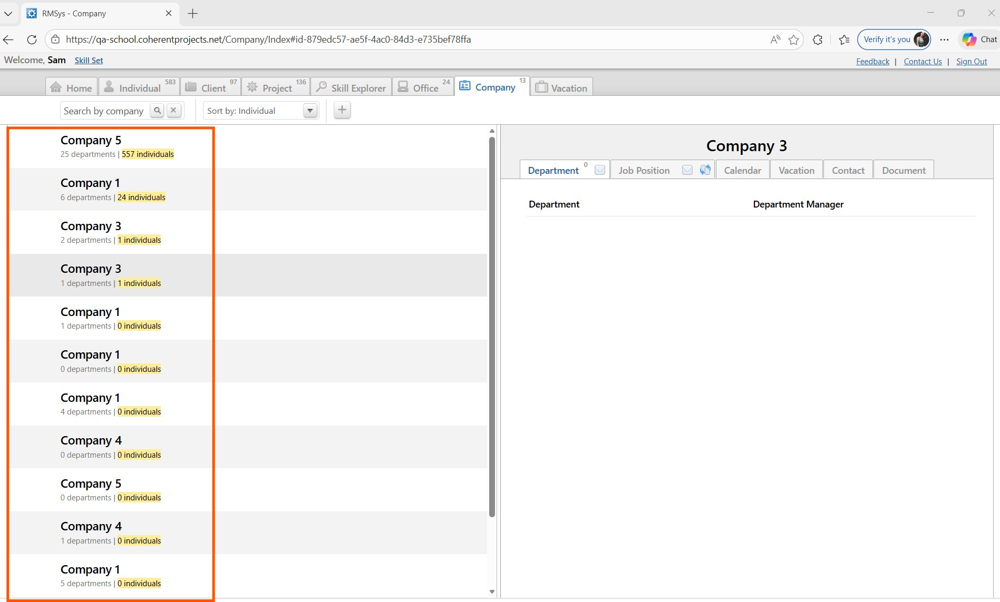
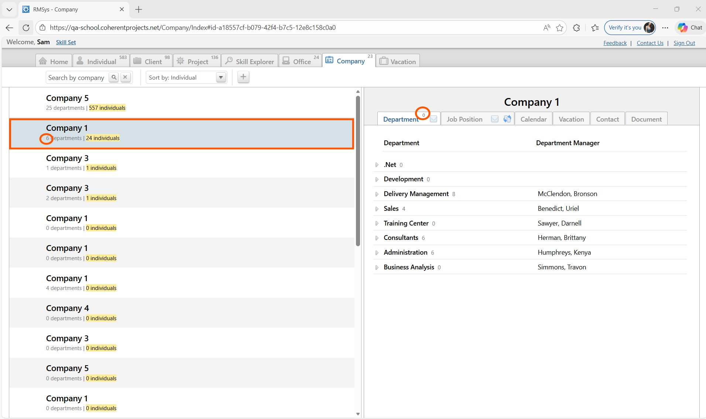
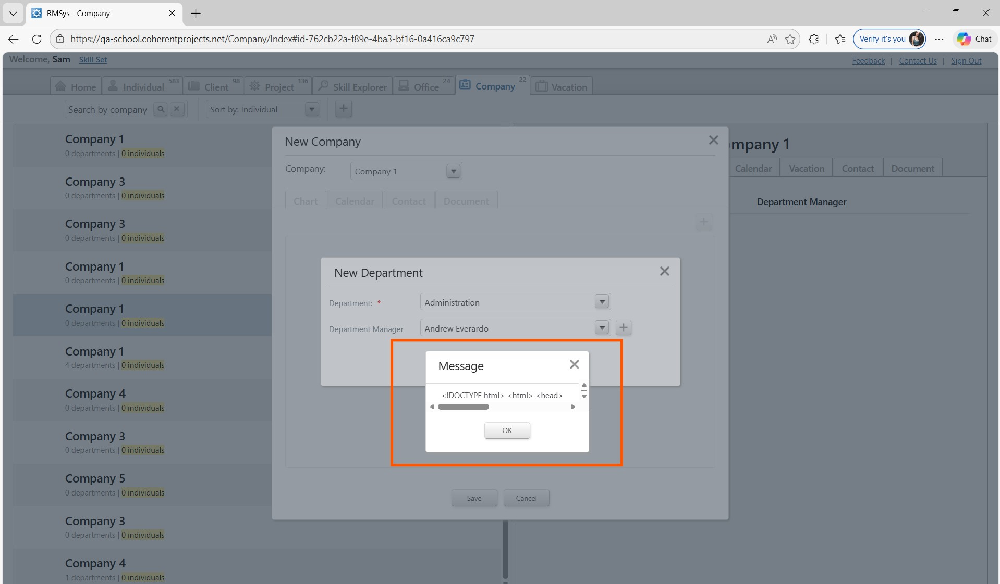
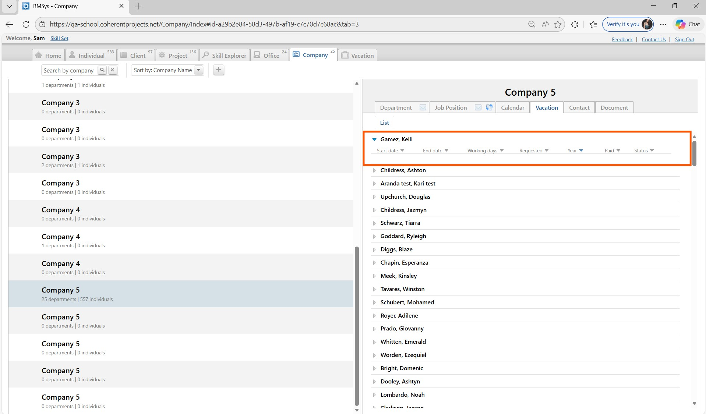
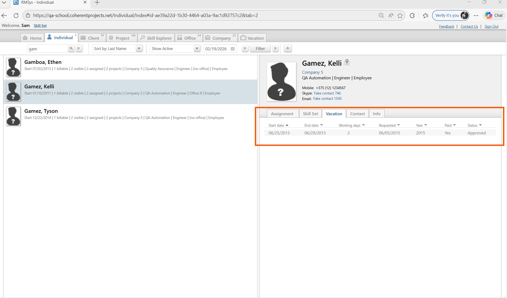

## Bug 1: Company list displays duplicate names

**Steps to Reproduce:**
1. Navigate to the “Company” tab
2. Observe the Company list

**Expected Result:**
Each company should be displayed only once

**Actual Result:**
Multiple companies with identical names are displayed

**Severity:** Major  
**Priority:** High  
**Attachments:**

## Bug 2: System allows sending email without selecting recipients

**Steps to Reproduce:**
1. Navigate to “Company” tab
2. Select “Company 1”
3. Go to Job Position tab
4. Click email icon
5. Deselect all recipients
6. Click “Save”

**Expected Result:**
System should prevent sending and show validation message

**Actual Result:**
Empty email form is opened without recipients

**Severity:** Major  
**Priority:** High  
**Attachments:**

## Bug 3: Department count mismatch between panels

**Steps to Reproduce:**
1. Navigate to “Company” tab
2. Select “Company 1”
3. Compare department count in left panel (6)
4. Compare department count in right panel (0)

**Expected Result:**
Department count should match in both panels

**Actual Result:**
Different department counts are displayed

**Severity:** Major  
**Priority:** Medium  
**Attachments:**

## Bug 4: HTML code displayed in message popup

**Steps to Reproduce:**
1. Navigate to “Company” tab
2. Create new Company
3. Add new Department
4. Click “Save”

**Expected Result:**
System should display a proper success message

**Actual Result:**
Popup displays raw HTML code

**Severity:** Major  
**Priority:** High  
**Attachments:**

## Bug 5: Vacation data inconsistency between modules

**Steps to Reproduce:**
1. Open “Individual” tab
2. Select employee (e.g. Gamez, Kelly)
3. Check Vacation tab → data exists
4. Navigate to “Company” tab
5. Open same employee
6. Check Vacation tab

**Expected Result:**
Vacation data should be consistent

**Actual Result:**
Vacation data differs between modules

**Severity:** High  
**Priority:** High  
**Attachments:**

## Bug 6: Missing "Acting as Approver" field in Create Vacation form

**Steps to Reproduce:**
1. Navigate to “Vacation” tab
2. Open “Create Vacation”

**Expected Result:**
Field "Acting as Approver" should be visible

**Actual Result:**
Field is missing

**Severity:** Critical  
**Priority:** High  
**Attachments:**

